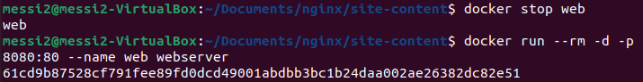
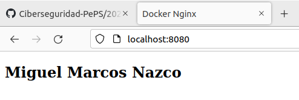

# Agregar un HTML personalizado a en servidor web dockerizado Nginx
## Instalación
(Previamente deberemos tener instalado docker en nuestra máquina)

Primero de todo debemos ejecutar:
docker run --rm -d -p 8080:80 --name web nginx
Con este comando ejecutaremos la imagen de nginx además de iniciar un contenedor de docker en el puerto local con el nombre de nginx

Para comprobar que este comando ha surtido efecto podemos dirigirnos al localhost, buscando este resultado:

Una vez comprobado paramos nuestro contenedor con:
docker stop web

## Agregar HTML personalizado
Nos dirigimos al directorio "Documents" y creamos un nuevo directorio de nombre "nginx", dentro de este creamos otro llamado "site-content" y dentro de este creamos el archivo "index.html" que contendrá nuestro html personalizado en su interior.

Una vez creado ejecutamos el comando:
docker run --rm -d -p 8080:80 --name web -v ~/Documents/nginx/site-content:/usr/share/nginx/html nginx

Con este comando creamos un volumen que montará nuestro directorio con la ruta del html recién creado (~/Documents/nginx/site-content) en el contenedor que se está ejecutando (/usr/share/nginx/html nginx)
Una vez hecho esto el localhost mostrará nuestro html:

## Crear una imagen personalizada
Ahora deberemos crear un Dockerfile, para esto nos dirigimos al directorio donde está nuestro html y creamos un archivo con el nombre "Dockerfile" y el siguiente contenido:
FROM nginx:latest
COPY ./index.html /usr/share/nginx/html/index.html

El primer comando, gracias al comando FROM, creamos una imagen personalizada con una imagen base y con el segundo comando sobrescribimos el html de nginx con el nuestro propio.
Seguidamente ejecutamos:
docker build -t webserver .
para construir nuestra imagen.
Finalmente ejecutamos nuestra imagen para comprobar que funciona en condiciones.

